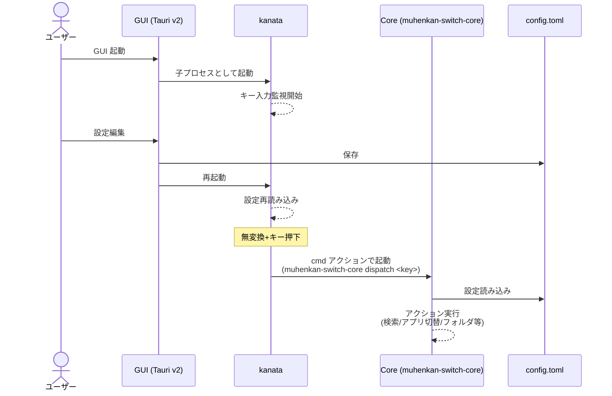
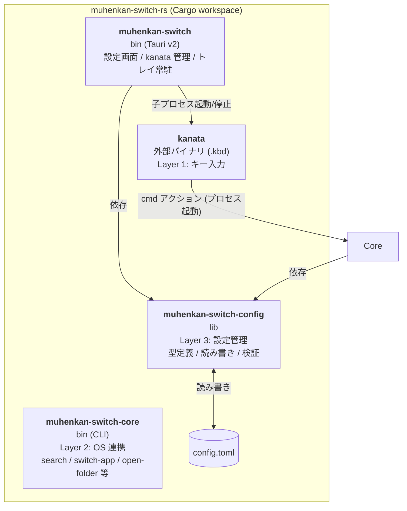

## 概要

現行の `muhenkan-switch`（AutoHotkey v2、Windows専用）をマルチプラットフォーム化する。

**アーキテクチャ:** kanata（既存OSSキーリマッパー）＋ Rust製 muhenkan-switch バイナリ ＋ Tauri v2 GUI

**前提条件:**
- 対象OS: Windows / macOS / Linux
- macOS は設定ファイルを提供するが、**開発者の検証環境がないため未検証**
- **JIS配列キーボード前提**。US配列は考慮しない
- ライセンス: GPL-2.0（現行を継承）

**設計方針:**
- kanata を外部バイナリとして利用（クレート組み込みはしない）
- kanata と muhenkan-switch は `cmd` アクション（プロセス起動）で疎結合に接続
- muhenkan-switch は非同期なし・ライフタイム注釈なしのシンプルな Rust コード（Windows の Win32 API 呼び出しのみ unsafe を使用）
- GUI は Tauri v2 + vanilla JS（Node.js ビルドステップなし）で設定の閲覧・編集を提供

---

## 現行機能の分類と実装方針

### Layer 1: キー入力のインターセプト → kanata に委譲

| 機能 | kanata での実現 |
|------|----------------|
| 無変換キーの tap/hold 判定 | `tap-hold` アクション |
| 無変換+X → 別キー出力 | レイヤー定義 |
| HJKL → カーソル移動 | レイヤー内で `left` `down` `up` `right` |
| YUIO → 単語移動/行頭行末 | レイヤー内マクロ |
| NM → BackSpace/Delete | レイヤー内で `bspc` `del` |
| カンマ・ピリオド → 句読点 | unicode 出力 |

### Layer 2: OS連携 → muhenkan-switch バイナリ（Rust）

| 機能 | 実装方針 |
|------|----------|
| アプリ切り替え | OS別: Win32 API (`windows` クレート) / wmctrl / osascript(未検証) |
| フォルダオープン | `open` クレート |
| 選択文字列 → Web検索 | `arboard`（クリップボード） + `webbrowser`（ブラウザ起動） |
| タイムスタンプ | `chrono` → `arboard`（クリップボード書き込み） |
| スクリーンショット | OS別コマンド呼び出し |

### Layer 3: 設定管理 → muhenkan-switch が config.toml を読み込み

- `toml` + `serde` で設定ファイルを構造体にデシリアライズ
- `toml_edit` を使用し、コメントを保持したまま保存
- 検索URL、アプリ名、フォルダパス、タイムスタンプ形式を設定可能
- 各エントリにディスパッチキー (`key`) を設定可能。保存時はキー順でソート（キーなしは末尾）
- バリデーション: タイムスタンプ形式・位置、検索URL の `{query}` プレースホルダ、ディスパッチキーの重複チェック（セクション横断）

---

## アーキテクチャ図

### 実行時のフロー

ユーザーが操作するのは GUI のみ。GUI が kanata を子プロセスとして起動し、kanata がキー押下時に CLI を呼び出す。



### コンポーネント構成



### Cargo ワークスペース構成

リポジトリは 3 つのクレートからなる Cargo ワークスペースで構成される。

| クレート | 種別 | 役割 |
|---------|------|------|
| `muhenkan-switch` | bin (Tauri) | **ユーザーが直接起動する唯一のアプリ**。config.toml の閲覧・編集 UI を提供し、kanata を子プロセスとして起動・停止・再起動する。システムトレイに常駐 |
| `muhenkan-switch-core` | bin | kanata から `cmd` アクションで呼び出される**実行エンジン**。search, switch-app, open-folder, timestamp, screenshot, dispatch サブコマンドを提供。ユーザーが直接起動することはない |
| `muhenkan-switch-config` | lib | 設定の型定義 (`Config`, `AppEntry` 等)、config.toml の読み書き (`load`/`save`)、バリデーション、ディスパッチキー解決。GUI と CLI の**両方から依存される共有ライブラリ** |

**3 つのクレートが独立している理由:**

- **GUI → kanata → CLI** という実行時フローにおいて、GUI と CLI は別プロセスとして動作するため、それぞれ独立したバイナリクレートが必要
- **config クレート** は設定の型・読み書き・検証ロジックを GUI と CLI で共有するために独立クレートとして切り出している。どちらか一方に置くと、もう片方がバイナリクレート全体に依存するか、コードを複製する必要が生じる

---

## CLI 仕様

```
muhenkan-switch-core <COMMAND> [OPTIONS]

Commands:
  dispatch     <KEY>              ディスパッチキーに対応するアクションを実行
  search       --engine <NAME>    選択テキスト（クリップボード）をWeb検索
  switch-app   --target <NAME>    指定アプリを最前面に
  open-folder  --target <NAME>    指定フォルダを開く
  timestamp    --action <ACTION>  タイムスタンプ操作 (paste|copy|cut)
  screenshot                      ウィンドウキャプチャ
```

設定は実行ファイルと同じディレクトリの `config.toml` から読み込む。

`dispatch` は kanata の `.kbd` ファイルから呼ばれる汎用エントリポイント。キーを受け取り、config.toml の各エントリの `key` フィールドを search → folders → apps の順に走査して対応するアクション（search / open-folder / switch-app）を実行する。これにより kbd ファイルはキー割り当ての詳細を持たず、全ての対応関係を config.toml で管理できる。

---

## kanata プロセス管理

GUI (Tauri) から kanata プロセスの開始・停止・再起動を行う。

- **再起動の用途:** kanata は `.kbd` 設定ファイルの変更を自動検知しないため、設定編集後に再起動して反映する
- バイナリ探索は exe 同梱ディレクトリ → カレントディレクトリ → ワークスペースルートの順にフォールバック
- **子プロセス自動終了 (Windows):** Job Object (`JOB_OBJECT_LIMIT_KILL_ON_JOB_CLOSE`) を使用し、GUI プロセス終了時に kanata を OS レベルで自動終了させる

---

## 無変換キーのOS間対応

| OS | kanata キー名 | 備考 |
|----|--------------|------|
| Windows | `muhenkan` | VK 0x1D。JISキーボードで正常認識 |
| Linux | `muhenkan` | evdev `KEY_MUHENKAN` (keycode 102) |
| macOS | `eisu` (推定) | JIS配列Macの「英数」キー。**未検証** |

---

## 使用クレート

| 用途 | クレート | バージョン |
|------|---------|-----------|
| CLI引数パース | `clap` (derive) | 4.x |
| クリップボード | `arboard` | 3.x |
| ブラウザ起動 | `webbrowser` | 1.x |
| ファイル/フォルダオープン | `open` | 5.x |
| TOML読み込み | `toml` + `serde` | 0.8.x / 1.x |
| TOML書き込み (コメント保持) | `toml_edit` | 0.22.x |
| 順序付きマップ | `indexmap` | 2.x |
| 子プロセス共有 | `shared_child` | 1.x |
| Job Object (Windows) | `windows` | 0.61.x |
| 日時処理 | `chrono` | 0.4.x |
| URLエンコード | `urlencoding` | 2.x |
| エラーハンドリング | `anyhow` | 1.x |

---

## ビルドとリリース

- GitHub Actions で Windows (x64) / Linux (x64) / macOS (x64, aarch64) のバイナリを自動ビルド
- タグ push (`v*`) でリリース作成
- リリース zip には muhenkan-switch バイナリ + .kbd + config.toml を同梱
- kanata 本体は同梱またはダウンロードリンクを案内

---

## 実装ロードマップ

### Phase 1: kanata コアキーマッピング ✅
- `muhenkan.kbd` で無変換 + HJKL カーソル移動を実装
- Windows / Linux で動作確認

### Phase 2: muhenkan-switch 最小実装 ✅
- 実装順序: open-folder → search → timestamp → switch-app
- kanata の `cmd` アクションとの結合テスト

### Phase 3: GUI (Tauri v2) ✅
- 設定の閲覧・編集 UI
- kanata プロセスの開始・停止・再起動
- システムトレイ常駐

### Phase 4: キーディスパッチ ✅
- `dispatch` サブコマンドの実装
- config.toml にキー割り当て (`key`) を追加
- GUI にディスパッチキー編集 UI を追加
- config crate テスト 24 件整備

### Phase 5: 機能拡充（継続）
- ビルド自動化 + GitHub Actions クロスコンパイル
- ホットストリング、スクリーンショット
